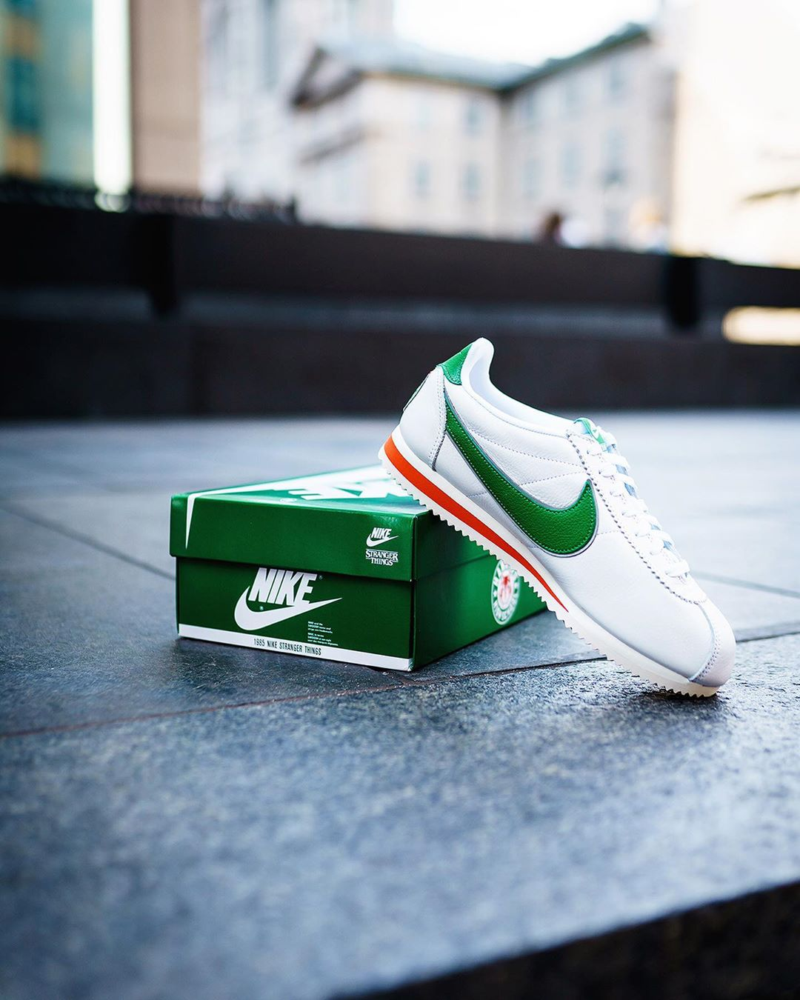

## How has Instagram impacted the relationship between Photography and Commerce? Come hear 2 experts on the topic followed by a meet and greet

Over the months we heard a lot of questions surrounding Instagram. We were also eager to host a more educational event. And last but not least we wanted to kickstart a project with our friends over at [Burst](https://burst.shopify.com)

>Burst is a free stock photo platform that is powered by Shopify [...] constantly uploading new photos and adding new categories to reflect current trends in ecommerce and retail.

We were humbled to have the support of Burst and Shopify Montréal for this event. And even more humbled to have two amazing speakers on stage that night.

### Instagram & Direct-To-Consumer Companies by Ali Inay

Ali is a photographer and founder of [#mtlcafecrawl](https://www.instagram.com/mtlcafecrawl/). He shared his experience and insights on DTC brands and how they leverage their Instagram presence.

### Instagram is part of the journey, not the destination by Vineeth Sampathkumar

Vineeth is a Growth Manager at Shopify and a sneaker photographer. He shared his growth tactics and branding strategy tips and how to apply them to your Instagram account.

_Intro and closing remarks were hosted by Jp Valery, founder of Montréal Photo Club and Katie Bowes, Operations Manager at Burst._

Make sure you don't miss the next event, sign up for our club below 👇
