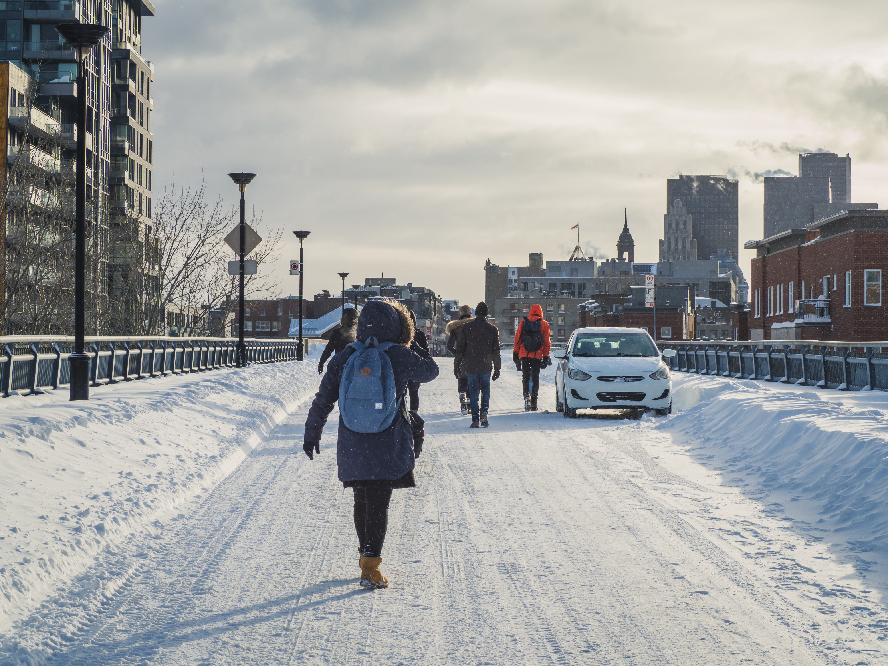
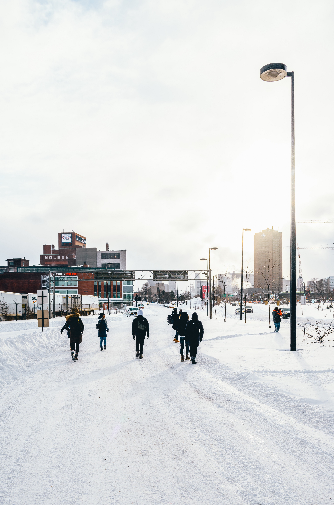

This is actually how everything started. I've been the [official Unsplash Host for Montréal](https://medium.com/unsplash/host-profile-jp-valery-72654ba707d5) since 2017. In that position, I've hosted various photowalks and meetups.

## Unsplash Photowalk - Montréal January 2018

The previous tentative had to be cancelled due to the uncooperative November weather, so when the forecast was snow, wind, and cold I was starting to think the Universe was against me hosting an Unsplash event. Fortunately, we were blessed with a great sun, a fresh layer of snow, and almost no one in the streets.

That being said, we can safely assume that the brave Unsplashers who joined collectively hold the title of “coldest Unsplash Photowalk (yet)”

We met up at Papineau station, after some delays gracieuseté de la STM. Despite temperatures flirting with the -25°C, a dozen of photographers joined (including a couple of Unsplash team members who call Montréal home).

From there, we headed towards the Jacques Cartier bridge. An iconic landmark from the city.

Our little group must have attracted attention. As everyone else in the city was cosying up home, you had this group of people walking together. All with cameras in their hands. We must definitely have confused some people along the way…

Today’s cold walk was very calm and simple. Everyone had their own vibe making the mood of the walk pretty interesting. It spawned in me the want to organize more of these photo events. Lucky for us, we got to capture the sunset piercing the snow and clouds. Overall it was a fun experience …

We walked along the railroad and the Molson Breweries to arrive in the Old Montreal.

As everyone was reaching their cold-tolerance tresholds, we found a coffee shop where we grabbed hot beverages. From there, and after about 2 hours outside in freezing temperatures, our little group parted ways.

## Unsplash Meetup @ Crew Café - Montréal September 2018

We hosted a small get together at Crew Collective and Café where we were able to chat and socialize in a more casual and relaxed way than during a photowalk
